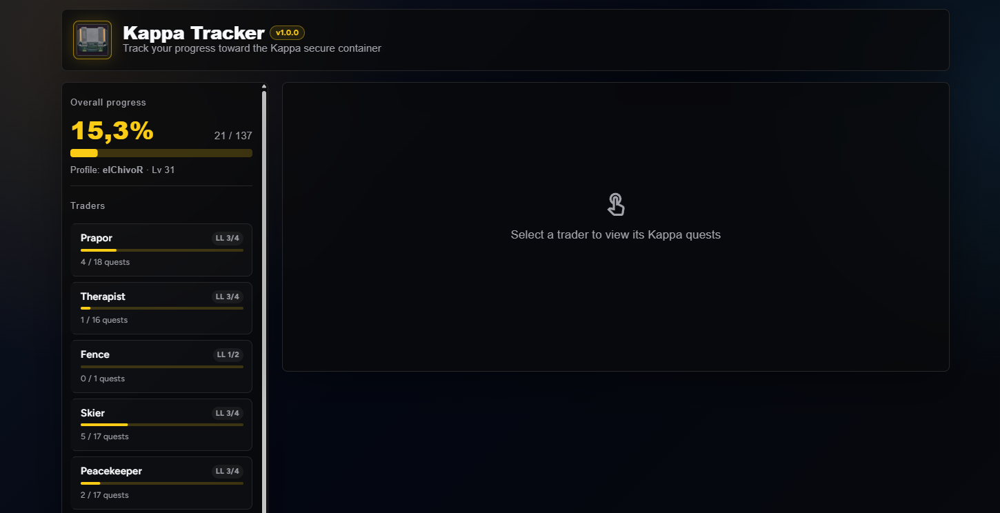

# Kappa Tracker

> A SPT server mod that adds a `/kappa` dashboard to the SPT web UI for tracking your
> progress toward the **Kappa** secure container — every milestone quest, its
> requirements, and the full chain of quests you still need to unlock it.




---

## Features

- **Overall Kappa progress** — a single live percentage over all **137** milestone
  quests (the *Collector* quest plus every quest it requires).
- **Per-trader breakdown** — loyalty level, quests completed / total and a progress
  bar for each trader that has Kappa quests.
- **Character level** shown next to your profile name.
- **Expandable quest panels** — for every Kappa quest of the selected trader:
  - live status: `Locked` · `Available` · `In progress` · `Turn in` · `Completed` · `Failed`
  - hand-in requirements with **item icons**, the amount you currently own, the
    amount required and whether it must be **Found in Raid**.
- **Path to unlock** — the full transitive chain of prerequisite quests for each
  milestone, in the order you can complete them, with:
  - gate notes (`Lv 12`, `LL 2 Prapor`, …) showing what unlocks each step
  - a `Kappa` tag on steps that are themselves milestone quests
  - per-step status and a completed / total counter
- **Quest-detail modal** — click any step in *Path to unlock* to open a modal with
  that quest's description, current status, unlock gate and hand-in requirements.
- **Auto-sync** — the whole dashboard refreshes every 5 seconds; no manual reload.
- **No footprint** — item icons are fetched once from `assets.tarkov.dev` and kept
  **in memory only**. Nothing is ever written into your mod folder.

## Browsing quest details

<video src="https://github.com/elChivoR/KappaTracker/raw/main/docs/media/quest-details.mp4" controls muted playsinline width="900"></video>

*(If the video does not play inline, [download / open it here](docs/media/quest-details.mp4).)*

---

## Installation

1. Download `KappaTracker.zip` from the [latest release](https://github.com/elChivoR/KappaTracker/releases/latest).
2. Extract it into your **SPT root** (the folder that contains `SPT_Runtime/`). The
   archive already has the right layout:
   ```
   SPT_Runtime/
     user/
       mods/
         KappaTracker/
           KappaTracker.dll
           wwwroot/
   ```
3. Start the SPT server.
4. Open the SPT web dashboard and pick **Kappa Tracker** from the mod list
   (or go straight to `/kappa`).

**Requirements:** SPT `4.1.x`. An internet connection is used only to fetch item
icons; the mod works offline without them.

---

## How it works

The mod reads the live quest database and your active profile on the server side:

- The milestone set is the *Collector* quest (`5c51aac1…`) plus every quest listed
  in its `AvailableForStart` conditions — 137 quests total. The overall percentage
  is `completed / 137`.
- `QuestGraphService` builds a directed graph of quest prerequisites from the quest
  DB on first use and walks it to produce each milestone's *Path to unlock*,
  attaching the level / loyalty gate that unlocks every step.
- Everything is read-only. The mod never changes your profile, quest state or the
  Kappa requirements.

---

## Building from source

```bash
dotnet build KappaTracker.csproj -c Release
```

This produces `bin/Release/KappaTracker.zip`, packaged with the exact folder layout
described in *Installation*.

**Requires:** .NET 10 SDK.

---

## License

MIT — see [LICENSE](LICENSE).
